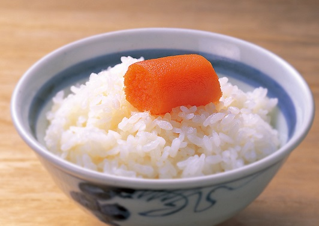

# mentaico

[TOC]

## プロジェクト概要

美味しい明太子ご飯を作る

## クラス説明

### Fish

生物学的分類としての魚を表すクラス
gadidae の親クラス

### Gadidae

生物学的分類としてのタラを表すクラス
alaskaPollock の親クラス

### AlaskaPollock

生物学的分類としてのスケトウダラを表すクラス

### Mentaico

スケトウダラの卵巣を唐辛子などで漬け込んだもの。

### Rice

正義の味方白米

日本人たるもの白米を食べなければ元気が出ない